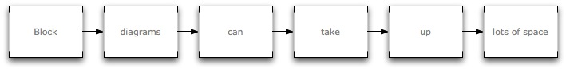

---
title: 'NIME Proceedings Template for Markdown'
author:
  - name: Ben Trovato
    affiliation: Institute for Clarity in Documentation
    address: 1932 Wallamaloo Lane Wallamaloo, New Zealand
    email: trovato@corporation.com
  - name: G.K.M. Tobin
    affiliation: University of Bricolage Programming
	address: P.O. Box 1212 Dublin, Ohio 43017-6221
    email: webmaster@marysville-ohio.com
  - name: Lars Thørväld
    affiliation: The Thørväld Group
    address: 1 Thørvald Circle Hekla, Iceland
    email: larst@affiliation.org
abstract: |
  This paper provides a samle of an experimental markdown template for the NIME conference series. It conforms, somewhat loosely, to the formatting guidelines for the LaTeX template.
  Replace this text with a 100-250 word abstract. You'll find it in the 'metadata block' at the top of your markdown document), be sure that each line of the abstract is indented.
  
documentclass: nime-alternate
bibliography: references.bib

keywords: NIME, proceedings, markdown, template

<!-- FixMe: a double column breaks the code -->
acmClass: See <http://www.acm.org/about/class/1998/> to obtain categories and subject descriptors for classifying this paper. An example follows H.5.5 [Information Interfaces and Presentation] Sound and Music Computing, H.5.2 [Information Interfaces and Presentation] User Interfaces—Haptic I/O, I.2.9 [Artificial Intelligence] Robotics—Propelling mechanisms.

...

# Introduction

Welcome to the experimental markdown template for the New Interfaces for Musical Expression (NIME) Conference, based on the International Conference on Live Coding 2016 template at <http://iclc.livecodenetwork.org/2016/>

<!-- FixMe: Indent -->
This document is a guide to using markdown for NIME, and is itself written in markdown. For full understanding, refer to nime2017.txt to see the source of this document, and nime2017.pdf to see the typeset output. Use of this template is currently only recommended for those familiar with command-line tools.

We suggest you take a copy of this template (nime2017.txt), and use it as a starting point for your NIME paper.

Preparing your submission using markdown will enable us to make proceedings available both in PDF files suitable for print, and in HTML suitable for the web. This is useful for making sure your paper is fully accessible, via Internet search, and with assistive technology such as screen readers for visually-impaired people. 

The remainder of this document is concerned with showing, in the context of an “actual” document, the markdwon format available for denoting the structure of a proceedings paper, rather than with giving rigorous descriptions or explanations of markdown.

<!-- We recommend taking a straightforward approach to formatting your document.
If you do not wish to use markdown, please do not be discouraged from submitting your paper. There is also a word document template available from the conference website.
-->

# Learning and using markdown

The best way to learn markdown is probably start at its project page: <http://daringfireball.net/projects/markdown/>.

We are happy to answer any questions you have about markdown in connection with your conference submission. This is best done via our online community: <http://www.nime.org>. Alternatively you may email the conference chairs directly: <papers@nime2017.org>

You may add footnotes like this [^1].

## Running pandoc {#pandoc}

Pandoc is software which turns text written in markdown into a beautiful looking document, complete with references. You will need to run it to create PDF documents of your paper for checking and uploading for peer review.

You may download pandoc for all major operating systems (including MS Windows, Apple Mac OS and GNU/Linux) from the following website: [http://johnmacfarlane.net/pandoc/](http://johnmacfarlane.net/pandoc/)

As an alternative to the above downloads, on OS X only, the homebrew package manager can be used to install pandoc: [http://brew.sh/](http://brew.sh/)

If you use homebrew to install on OS X you will need to install both the pandoc and pandoc-citeproc packages as follows:

```
brew update
brew install pandoc
brew install pandoc-citeproc
```

To produce PDF files you will need to have LaTeX installed, as well as pandoc. See the pandoc website for installation instructions: [http://johnmacfarlane.net/pandoc/installing.html](http://johnmacfarlane.net/pandoc/installing.html). LaTeX is used internally, you will not have to edit any LaTeX documents.

To render your markdown source as HTML, open a terminal window, change into the folder where the template is and run the following command:

~~~~ {.bash}
pandoc --template=pandoc/nime.html --filter pandoc-citeproc -N nime2017.txt -o nime2017.html
~~~~

To produce a PDF document, make sure you have LaTeX installed (see
above), and run the following:

~~~~ {.bash}
pandoc --template=pandoc/nime.latex --filter pandoc-citeproc -N nime2017.txt -o nime2017.pdf
~~~~

For a higher quality output, add the option `--latex-engine=xelatex`
to the above. You will need the [Inconsolata](http://levien.com/type/myfonts/inconsolata.html) and [Linux Libertine](http://www.linuxlibertine.org/index.php?id=91&L=1) opentype fonts installed.

An example Makefile is also provided to run these commands for you. A simple

~~~~ {.bash}
make all
~~~~

will produce both the .pdf and .html version of your paper, wherease 

~~~~ {.bash}
make clean
~~~~

will remove them both [^2]. And finally, the third footnote [^3].

## Citations ##

Citations to articles [@bowman:reasoning;@clark:pct;@braams:babel;@herlihy:methodology], conference proceedings [@clark:pct] or books [@salas:calculus;@Lamport:LaTeX] listed in the Bibliography section of your article will occur throughout the text of your article.

The pandoc command given in the [above section](#pandoc) will automatically render your references according to Chicago author-date style.

At the head of the markdown source file for this template, you will see an entry for "bibliography" that points to the file references.bib. Here you'll find examples of bibliography entries in BibLaTex format, including examples for articles, books, book chapters and items from conference proceedings.

## Code ##

We have chosen a single column layout in html to better support code examples without having to break lines. The following shows how to include a code example with syntax highlighting:

~~~~ {.haskell}
d1 $ every 3 (iter 4) $ brak $ "bd [sn [[sn bd] sn]]*1/3"
~~~~

In two-column pdf, we have tried to ensure that code has line breaks and fits within a column. But you may need to manually adjust the whitespace of your code. For a list of supported languages, you can visit <http://johnmacfarlane.net/highlighting-kate/>. If your favourite language isn't listed, perhaps a language with a similar syntax will still work.


## Figures

Images should be included as figures, with captions provided and formatted as shown in Figure 1. Be prepared for the page layout and image size to be changed during the editing and layout process, and consider this when referring to the figures in the text.



## Tables

Tables work (except the first page).

  Format            File extension
  ------------      --------------
  MODS              .mods
  BibLaTeX          .bib
  BibTeX            .bibtex
  RIS               .ris
  EndNote           .enl
  EndNote XML       .xml
  ISI               .wos
  MEDLINE           .medline
  Copac             .copac
  JSON citeproc     .json

Table: Supported bibliography formats with file extension.

## Math Equations

You may want to display math equations in three distinct styles: inline, numbered or non-numbered display. Each of the three are discussed in the next sections.

Inline LaTeX equations can be written in a pair of dollar signs using the LaTeX syntax, e.g., $f(k) = {n \choose k} p^{k}$; math expressions of the display style can be written in a pair of double dollar signs, e.g., $$f(k) = {n \choose k} p^{k} (1-p)^{n-k}$$


# Video

YouTube video linked:

[](http://www.youtube.com/watch?v=eTSNJPs8OH8)

YouTube video embedded:

<iframe width="560" height="315" src="https://www.youtube.com/embed/eTSNJPs8OH8" frameborder="0" allowfullscreen></iframe>

Vimeo linked

[](https://vimeo.com/100148085)

Vimeo embedded:

<iframe src="https://player.vimeo.com/video/67185300" width="640" height="360" frameborder="0" webkitallowfullscreen mozallowfullscreen allowfullscreen></iframe>


# Conclusion #

We look forward to receiving your completed papers. Submission is through the online peer review system at <https://precisionconference.com/~nime>. Please submit a PDF version of your paper for peer review. At a later stage in preparing the proceedings, we may ask for the markdown or Word versions of your paper.


# Acknowledgments 


This section is optional; it is a location for you to acknowledge grants, funding, editing assistance and what have you.

NIME'17 chairs acknowledge LCRN chair David Ogborn <ogbornd@mcmaster.ca>. Please remember to visit their forum at <http://lurk.org/groups/lcrn/>.


# References

[^1]: This is the first footnote. It starts a series of three footnotes that add nothing informational, but just give an idea of how footnotes work and look. It is a wordy one, just so you see how a longish one plays out.

[^2]: The second footnote. In the makefile, there is also an experimental .docx version, which can be extended by pandoc's --reference-docx switch.

[^3]: Let's keep this one short.
